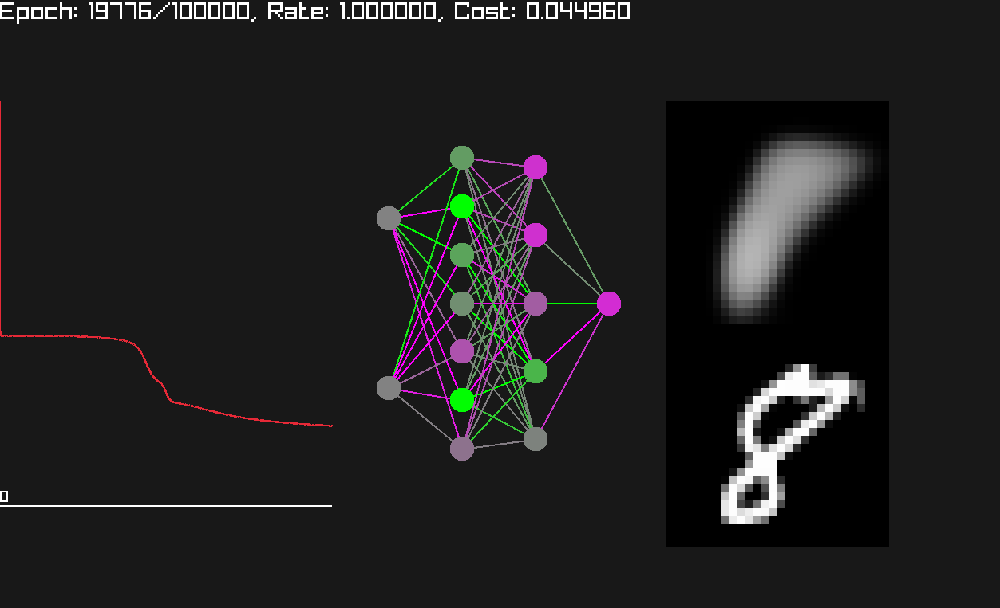

# nn.h

Simple stb-style head-only library for Neural Networks. Created for educational purposes. Not suitable for production.



## Quick Start

```console
$ ./build.sh
$ ./adder_gen
$ ./gym ./adder.arch ./adder.mat
```

## Gym

Gym is a separate GUI app that uses nn.h to pre-train Neural Networks.

### Controls

|Keys|Description|
|---|---|
|<kbd>SPACE</kbd>|Toggle pause|
|<kbd>r</kbd>|Restart the training|
